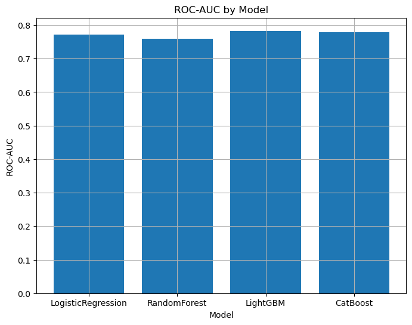
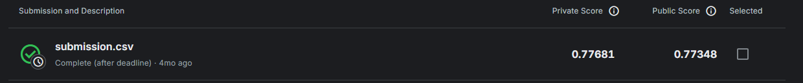
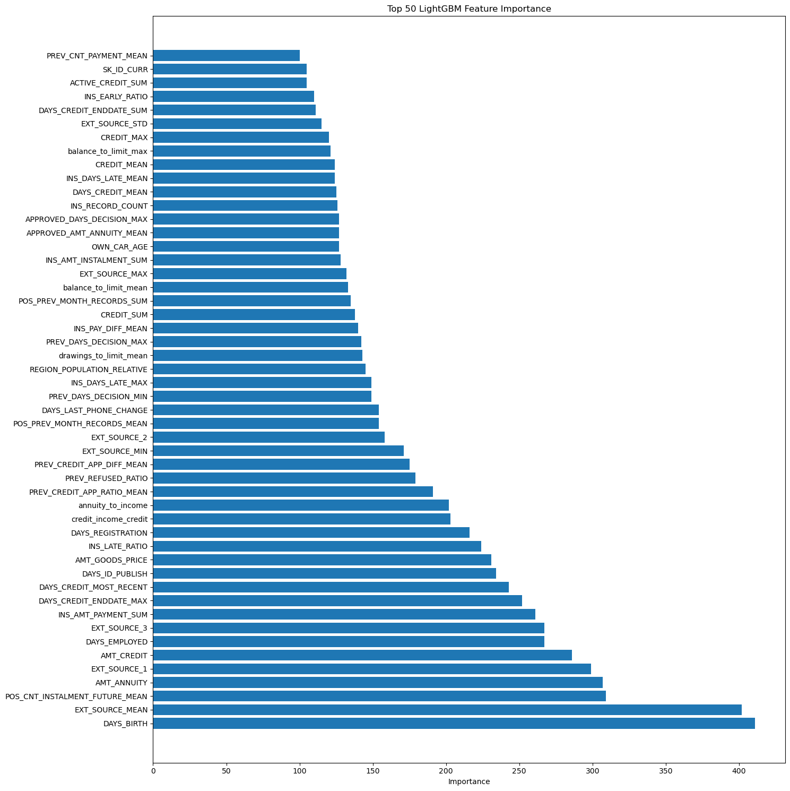

# Home Credit Default Risk

Проект машинного обучения для оценки вероятности дефолта по кредиту на основе разнородных клиентских данных из соревнования [Home Credit Default Risk](https://www.kaggle.com/competitions/home-credit-default-risk).

## Результаты

| Базовая модель | Accuracy | ROC-AUC | PR-AUC |
|---|---:|---:|---:|
| **LightGBM** | **0.9202** | **0.7828** | **0.2817** |
| CatBoost | 0.9200 | 0.7793 | 0.2765 |
| Logistic Regression | 0.9195 | 0.7719 | 0.2586 |
| Random Forest | 0.9193 | 0.7589 | 0.2483 |

LightGBM показал лучший результат среди сравниваемых моделей по ROC-AUC и PR-AUC.



Финальный `submission.csv` для Kaggle получил `Public Score 0.77348` и `Private Score 0.77681`.



## Подход

- объединение и агрегация нескольких реляционных таблиц с историей клиента;
- построение признаков по bureau, installments, POS, credit card и application-уровню;
- сравнение Logistic Regression, Random Forest, LightGBM и CatBoost;
- анализ важности признаков и устойчивости качества к их количеству;
- оптимизация LightGBM с помощью Optuna;
- трекинг параметров, метрик и моделей в MLflow;
- воспроизводимый пайплайн подготовки данных и обучения через DVC;
- подготовка submission-файла для Kaggle.



## Инструменты

Python, pandas, NumPy, scikit-learn, LightGBM, CatBoost, Optuna, MLflow, DVC, matplotlib, seaborn.

## Структура репозитория

```text
data_loader.py       загрузка и агрегация исходных таблиц
features.py          генерация признаков по реляционным данным
preprocessing.py     очистка и кодирование признаков
modeling.py          модели и целевая функция для Optuna
train_model.py       обучение, оценка, MLflow-логирование и submission
visualization.py     функции визуализации
main.ipynb           исследование данных и основной ноутбук проекта
dvc.yaml / dvc.lock  описание и фиксация воспроизводимого пайплайна
assets/              графики, вынесенные из ноутбука
```

## Воспроизведение

```bash
pip install -r requirements.txt
dvc repro
```
